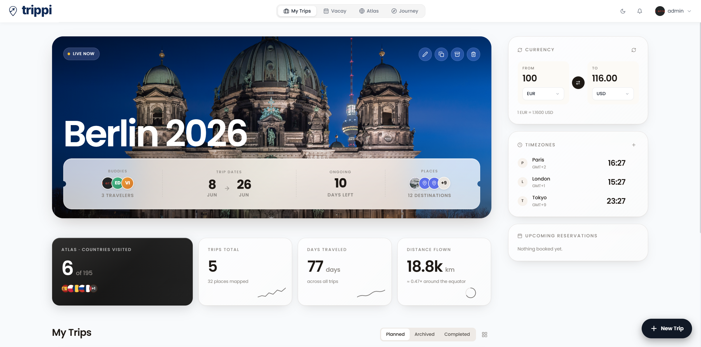
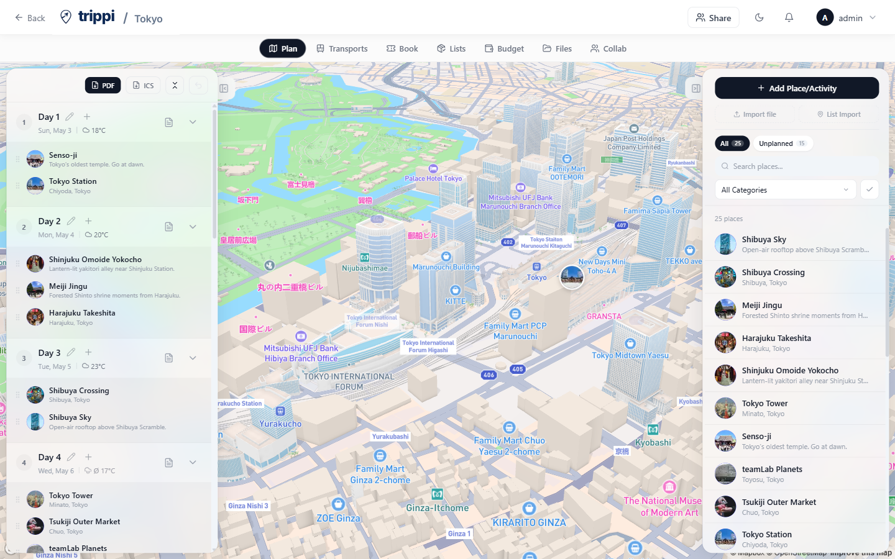
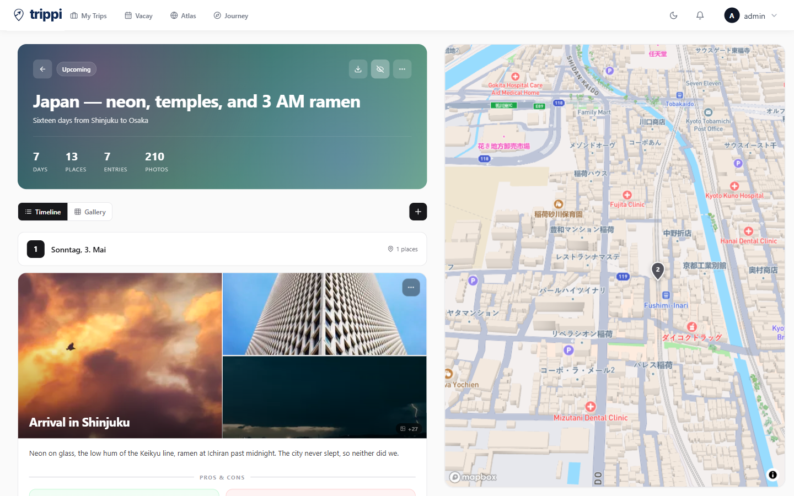
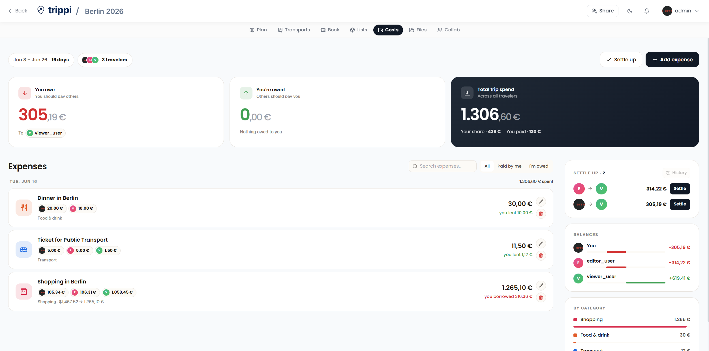
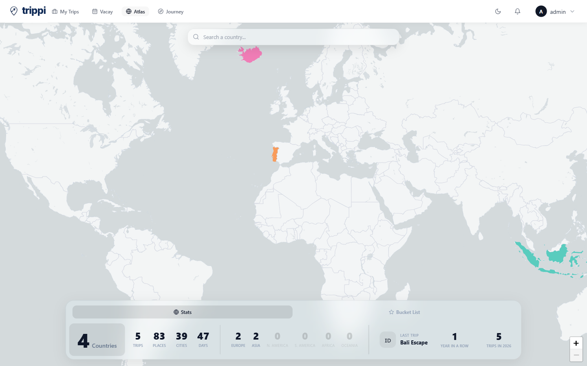
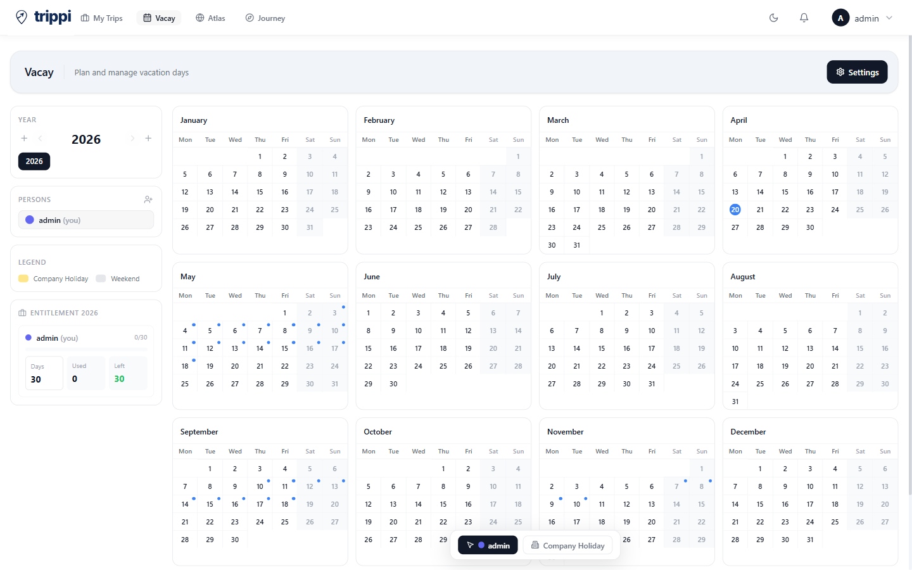
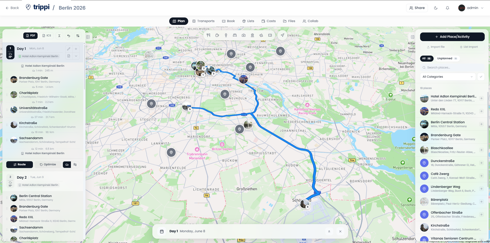
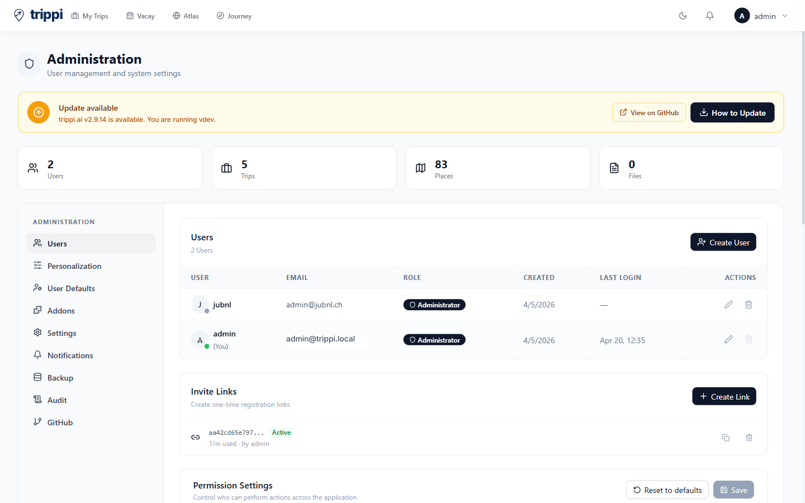
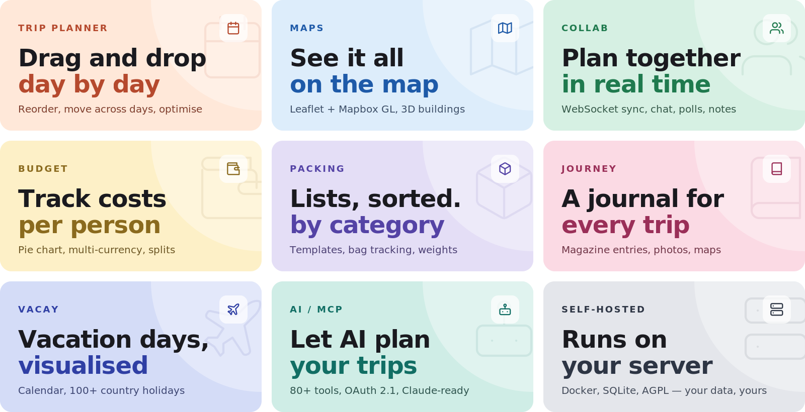

<picture>
  <source media="(prefers-color-scheme: dark)" srcset="docs/brand/trippi-wordmark-light.png" />
  <source media="(prefers-color-scheme: light)" srcset="docs/brand/trippi-wordmark.png" />
  
</picture>

 

<strong>Your trippi, our troppi.</strong>

Planning a trip should be exciting &mdash; not annoying.

  <a href="https://trippi.ai/">trippi.ai</a> helps you turn messy travel ideas into a clear, organized itinerary.
  No more jumping between maps, notes, booking emails, spreadsheets, and group chats.

  Build your adventure in one place: interactive maps,
  drag-and-drop itineraries, route planning, budgets, reservations, and everything else that keeps your trip on track.

  Connect with AI agents like ChatGPT, Claude, and Gemini,
  so they can help plan your trip with you. Simply tell it where you want to go, what kind of experience you want, and let it
  handle the rest.

Say goodbye to chaotic trip planning. Say hello to your trippi.

 

---

 

  
  
  
  
  
  
  
  

---

## What you get

<picture>
  <source media="(max-width: 700px)" srcset="docs/tiles/grid-mobile.svg" />
  
</picture>

<b>See all features</b>

<table>
<tr>
<td width="50%" valign="top">

#### 🧭 Trip planning

- **Drag & drop planner** — organise places into day plans with reordering and cross-day moves
- **Interactive map** — Leaflet or Mapbox GL with 3D buildings, terrain, photo markers, clustering, route visualization
- **Place search** — Google Places (photos, ratings, hours) or OpenStreetMap (free, no API key)
- **Place import** — shared Google Maps / Naver Maps lists, plus GPX and KML/KMZ/GeoJSON map files
- **Day notes** — timestamped, icon-tagged notes with drag-and-drop reordering
- **Route optimisation** — auto-sort places and export to Google Maps
- **Weather forecasts** — 16-day via Open-Meteo (no key) + historical climate fallback
- **Category filter** — show only matching pins on the map

</td>
<td width="50%" valign="top">

#### 🧳 Travel management

- **Reservations** — flights, accommodations, restaurants with status, confirmation numbers, files; import from booking confirmation emails and PDFs ([KDE Itinerary](https://invent.kde.org/pim/kitinerary))
- **Costs** — track and split trip expenses (Splitwise-style): per-person / per-day breakdowns, settle-up, multi-currency
- **Packing lists** — categories, templates, user assignment, progress tracking
- **Bag tracking** — optional weight tracking with iOS-style distribution
- **Document manager** — attach docs, tickets, PDFs to trips / places / reservations (≤ 50 MB each)
- **PDF export** — full trip plan as PDF with cover page, images, notes

</td>
</tr>
<tr>
<td width="50%" valign="top">

#### 👥 Collaboration

- **Real-time sync** — WebSocket. Changes appear instantly across all connected users
- **Multi-user trips** — invite members with role-based access
- **Invite links** — one-time or reusable links with expiry
- **SSO (OIDC)** — Google, Apple, Authentik, Keycloak, or any OIDC provider
- **2FA** — TOTP + backup codes
- **Passkeys** — passwordless WebAuthn login (fingerprint / face / PIN / security key), admin-toggleable
- **Collab suite** — group chat, shared notes, polls, day check-ins

</td>
<td width="50%" valign="top">

#### 📱 Mobile & PWA

- **Installable** — iOS and Android, straight from the browser, no App Store needed
- **Offline support** — Service Worker caches tiles, API, uploads via Workbox
- **Native feel** — fullscreen standalone, themed status bar, splash screen
- **Touch optimised** — mobile-specific layouts with safe-area handling

</td>
</tr>
<tr>
<td width="50%" valign="top">

#### 🧩 Addons (admin-toggleable)

- **Lists** — packing lists + to-dos with templates, member assignments, optional bag tracking
- **Costs** — expense tracker with splits and settle-up (who owes whom), multi-currency
- **Documents** — file attachments on trips, places, and reservations
- **Collab** — chat, notes, polls, day-by-day attendance
- **Vacay** — personal vacation planner with calendar, 100+ country holidays, carry-over tracking
- **Atlas** — world map of visited countries, bucket list, travel stats, streak tracking, liquid-glass UI
- **Journey** — magazine-style travel journal with entries, photos (Immich/Synology), maps, moods
- **AirTrail** — connect a self-hosted AirTrail instance to import and sync flights into reservations
- **MCP** — expose trippi.ai to AI assistants via OAuth 2.1

</td>
<td width="50%" valign="top">

#### 🤖 AI / MCP

- **Built-in MCP server** — OAuth 2.1 authenticated. 150+ tools, 30 resources
- **Granular scopes** — 27 OAuth scopes across 13 permission groups
- **Full automation** — AI can create trips, plan days, build packing lists, manage budgets, mark countries visited
- **Pre-built prompts** — `trip-summary`, `packing-list`, `budget-overview`
- **Addon-aware** — exposes Atlas, Collab, Vacay when those addons are on

</td>
</tr>
<tr>
<td colspan="2" valign="top">

#### ⚙️ Admin & customisation

- **Dashboard views** — card grid or compact list · **Dark mode** — full theme with matching status bar
- **20 languages** — EN, DE, ES, FR, IT, NL, HU, RU, ZH, ZH-TW, PL, CS, AR (RTL), BR, ID, TR, JA, KO, UK, GR
- **Admin panel** — users, invites, packing templates, categories, addons, API keys, backups, GitHub history
- **Notifications** — per-user preferences across email (SMTP), webhook, ntfy, and an in-app notification center
- **Auto-backups** — scheduled with configurable retention · **Units** — °C/°F, 12h/24h, map tile sources, default coordinates

</td>
</tr>
</table>

 

## License

trippi.ai is [AGPL v3](LICENSE). Self-host freely for personal or internal company use. If you modify and offer trippi.ai as a network service to third parties, your modifications must be open-sourced under the same licence.
