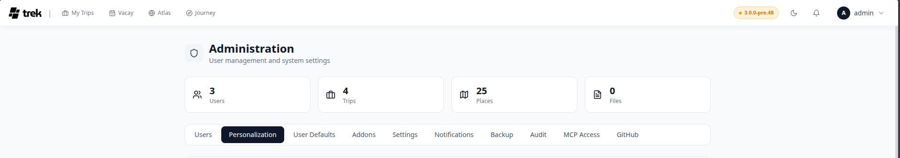

# Admin Panel Overview

The Admin Panel is the central control surface for TREK instance operators. It is only accessible to users with the `admin` role.

## Accessing the Admin Panel

Navigate to the **Admin** link in the top navbar. If you do not see it, your account does not have admin privileges.

<!-- TODO: screenshot: admin panel main dashboard with tabs -->

## Tabs

The Admin Panel is divided into tabs. Most tabs are always visible; a few appear only under specific conditions.

| Tab | Purpose | Conditional? |
|-----|---------|--------------|
| **Users** | Manage users, invite links, and permissions | No |
| **Personalization** | Packing templates and place categories | No |
| **User Defaults** | Default settings applied to new users | No |
| **Addons** | Enable or disable optional features instance-wide | No |
| **Settings** | Authentication methods, MFA, allowed file types, API keys, OIDC/SSO configuration, and JWT secret rotation | No |
| **Notifications** | SMTP, webhook, ntfy, and push notification channel configuration; trip reminder toggle; admin notification preferences | No |
| **Backup** | Manual and scheduled database backups | No |
| **Audit** | Chronological activity log | No |
| **MCP Access** | OAuth sessions and static API tokens | Only when the MCP addon is enabled |
| **GitHub** | Release timeline and support links | No |
| **Dev: Notifications** | Test notification dispatch | Only in development mode (`NODE_ENV=development`) |

## Related pages

- [Admin-Users-and-Invites](Admin-Users-and-Invites)
- [Admin-Addons](Admin-Addons)
- [Admin-Categories](Admin-Categories)
- [Admin-Packing-Templates](Admin-Packing-Templates)
- [Admin-Permissions](Admin-Permissions)
- [Admin-MCP-Tokens](Admin-MCP-Tokens)
- [Admin-GitHub-Releases](Admin-GitHub-Releases)
