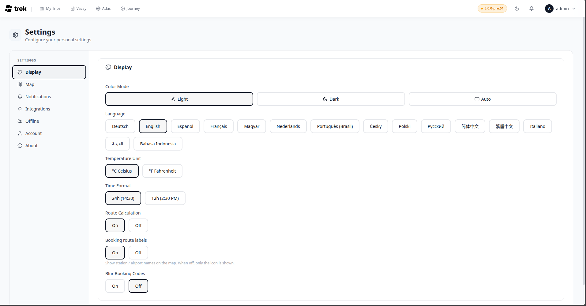

# Display Settings

The Display tab (Settings → Display) controls the visual appearance and locale preferences of the app. All changes save immediately to your account and persist across devices.

<!-- TODO: screenshot: appearance settings panel -->

## Color mode

Choose between three options:

| Option | Behaviour |
|--------|-----------|
| Light | Always uses the light theme |
| Dark | Always uses the dark theme |
| Auto | Follows your operating system / browser preference |

## Language

Select your preferred language from the button grid (desktop) or dropdown (mobile). The change takes effect immediately without a page reload. See [Languages](Languages) for the full list of supported languages.

## Temperature unit

Affects the weather widget on trip days.

| Option | Display |
|--------|---------|
| °C Celsius | Metric |
| °F Fahrenheit | Imperial |

## Time format

Affects all time displays throughout the app.

| Option | Example |
|--------|---------|
| 24h | 14:30 |
| 12h | 2:30 PM |

## Route calculation

Toggles automatic route calculation between places on the trip map. Set to **On** or **Off**.

## Booking route labels

Shows or hides labels on booking-related route segments on the map. Set to **On** or **Off**.

## Blur booking codes

When enabled, confirmation codes and reference numbers are blurred until you hover or tap. Set to **On** or **Off**.

## See also

- [Languages](Languages)
- [User-Settings](User-Settings)
