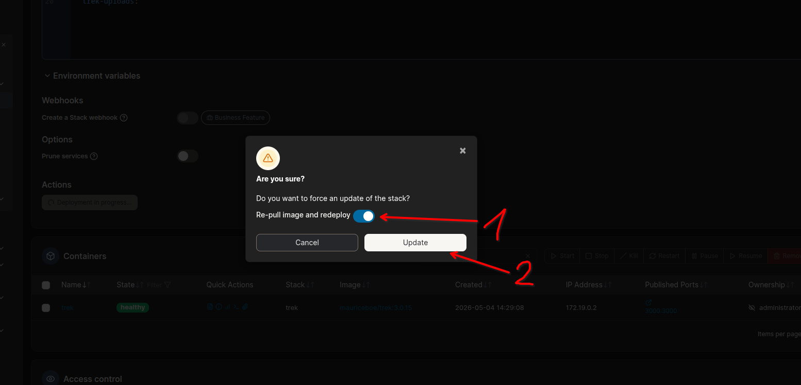
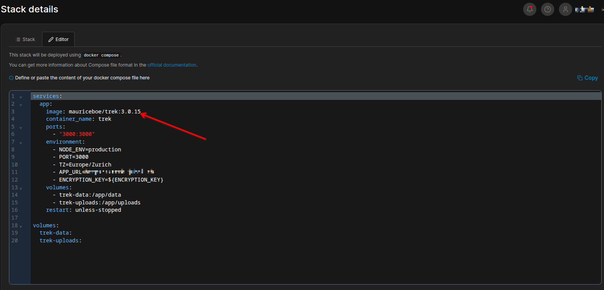
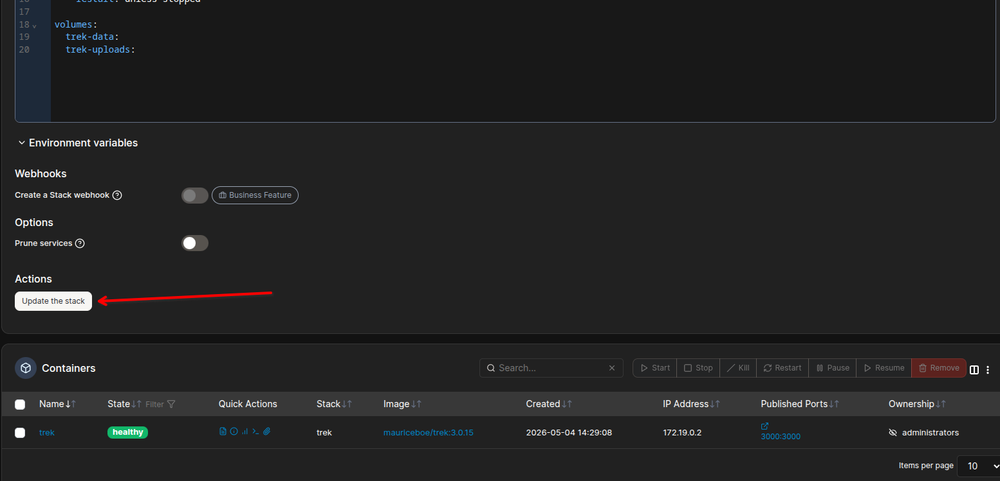

# Updating

How to update trippi.ai to a newer version without losing data.

## Before You Update

Back up your data first. Go to Admin Panel → Backups and create a manual backup, or copy your `./data` and `./uploads` directories to a safe location. See [Backups](Backups) for details.

## Image Tags

| Tag | Example | Behavior |
|---|---|---|
| `latest` | `shiverin/trippi.ai:latest` | Always the newest release across all major versions |
| Major version | `shiverin/trippi.ai:3` | Latest release pinned to that major version |
| Full version | `shiverin/trippi.ai:3.0.15` | Exact release; never changes |

Use `latest` or a major-version tag if you want updates on each redeploy. Use a full version tag for explicit control — update by changing the tag, not by re-pulling.

## Docker Compose (Recommended)

**`latest` or major-version tag:**

```bash
docker compose pull && docker compose up -d
```

This pulls the newest matching image and recreates the container with your existing volumes. Your data is untouched.

**Pinned full-version tag:**

Edit `docker-compose.yml`, update the tag in the `image:` line (e.g. `3.0.15` → `3.0.16`), then redeploy:

```bash
docker compose up -d
```

## Docker Run

If you started trippi.ai with `docker run`, pull the new image and replace the container:

```bash
docker pull shiverin/trippi.ai
docker rm -f trek
docker run -d --name trek -p 3000:3000 \
  -v ./data:/app/data \
  -v ./uploads:/app/uploads \
  -e ENCRYPTION_KEY=<your-key> \
  --restart unless-stopped \
  shiverin/trippi.ai
```

> **Tip:** Not sure which volume paths you used? Check before removing:
> ```bash
> docker inspect trippi --format '{{json .Mounts}}'
> ```

## Database Migrations

trippi.ai runs any pending database migrations automatically at startup. No manual migration steps are required after pulling a new image.

## Encryption Key Note

If you are upgrading from a version that predates the dedicated `ENCRYPTION_KEY` (i.e. you have no `ENCRYPTION_KEY` environment variable set), trippi.ai automatically falls back to `./data/.jwt_secret` on startup and immediately promotes it to `./data/.encryption_key`. No manual steps are required — the transition is handled at first boot after the upgrade.

If you want to rotate to a new key at any point (not required for a normal update), see [Encryption-Key-Rotation](Encryption-Key-Rotation) for the full procedure.

## Proxmox VE (LXC)

If you installed trippi.ai via the [Proxmox VE Community Scripts](https://community-scripts.org/scripts/trek), run the following command inside the **LXC container** and select **Update** when prompted:

```bash
bash -c "$(curl -fsSL https://raw.githubusercontent.com/community-scripts/ProxmoxVE/main/ct/trippi.sh)"
```

> **Tip:** Always check the [community-scripts trippi.ai page](https://community-scripts.org/scripts/trek) to confirm the latest command before running.

The script stops the service, backs up your data and uploads, applies the new release, restores the backup, and restarts. No manual steps required.

To verify the update completed and check for errors:

```bash
# Inside the container (pct enter <id> from the Proxmox shell)
journalctl -u trippi -n 50
```

## Portainer

Open the **Stacks** list, click the trippi.ai stack, then click **Redeploy**.

**`latest` or major-version tag** — enable the **Re-pull image and redeploy** switch before confirming. Portainer pulls the newest matching image and recreates the container.



**Pinned full-version tag** (e.g. `3.0.15`) — edit the stack, update the tag in the `image:` line, then click **Update the stack**. No re-pull switch needed; the tag change forces a fresh pull.





See [Install-Portainer](Install-Portainer) for the full installation walkthrough.

## Unraid

In the Unraid Docker tab, click the trippi.ai container and select **Update**. Unraid will pull the latest image and restart with the same volumes.

## Next Steps

- [Backups](Backups) — schedule automatic backups so you always have a restore point before updates
- [Encryption-Key-Rotation](Encryption-Key-Rotation) — if you need to rotate or migrate the encryption key
- [Install-Docker-Compose](Install-Docker-Compose) — switch to Compose for easier future updates
